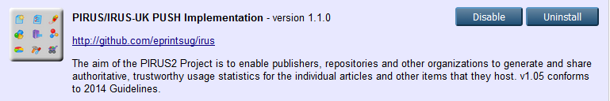
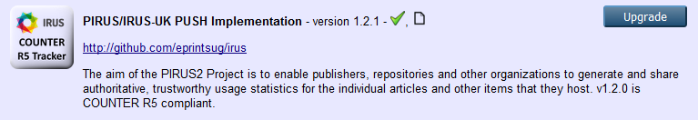
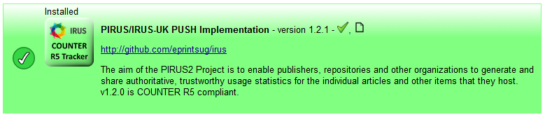
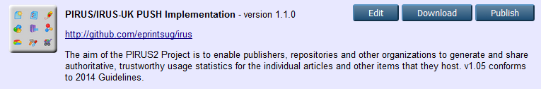
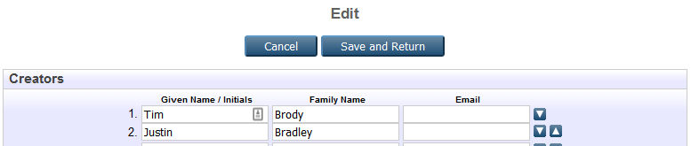

# Notes on upgrading IRUS

*If your EPrints service is hosted by a 3rd party, please liaise with them regarding the upgrade of the IRUS software.
They may already be aware of this process, or may have other ways to manage this.*

If you have installed IRUS from the EPrints Bazaar, and not edited the configuration files at all, 
the upgrade process should be as simple as clicking an 'Upgrade' button in the EPrints Bazaar.

If you have modified any of the IRUS files, that automated upgrade via the Bazaar may fail (see below).

If at some point the transfer of data to IRUS has failed, there may be an Event in the index queue. To check, 
as the admin user, follow the **Manage records** link, and then click the **Tasks** link. Look for an entry with 
the plugin 'Event::PIRUS'. If you have a lot of items in the index queue, using the filter might be the quickest 
way of finding this.
If there is an 'Event::PIRUS' entry, it may be safest to turn the indexer off before starting the upgrde process, and turning it back on again after the new version is installed.

## Upgrade process

* Navigate to the Admin screen in EPrints
* From the **System Tools** tab, click on the **EPrints Bazaar** button
* In the **Installed** tab, you should see the current version installed:
  
* In the **Available** tab, you should be able to see the latest version of the IRUS package, with an **Upgrade** button next to it:
  
* Clicking the **Upgrade** button should result in a message similar to this:
   
  **You should also restart the indexer at this time** and it would be advisable to restart the webserver.
  

## Failure due to edited files

If the above process results in a message such as:
 
it means that there have been some alterations to the IRUS code on your server. This may have been someone adding the new tracker endpoint, for example. *NB There are ways to achieve this without editing the installed files. If you are in this situation and would like some advice about how to make more sensible changes to your repository configuration, please contact the EPrints Tech List.**

At this point it is probably safer to check on the server itself what has changed (and why). There may have been additional configuration added that will need to be re-implemented during the upgrade.

If you are confident that any changes that have been made to the IRUS install are either covered by the upgrade, or not necessary, you can follow this procedure to upgrade IRUS:
* From the EPrints Bazaar page, open the **Developer Tools** tab.
* Click on 'Edit' next to the IRUS package

* Don't edit anything, click **Save and Return**. This will re-calculate the checksums of the IRUS files, and allow you to upgrade as above.

## Performaing a clean re-install

If you want to make a clean install of the IRUS plugin:
1. Stop indexer
2. Remove any of the following that exist:
   - `[EPRINTS_ROOT]/lib/epm/irus/*` and/or `[EPRIINTS_ROOT]/lib/epm/irus-dev/*`
   - `[EPRINTS_ROOT]/lib/plugins/EPrints/Plugin/Event/PIRUS.pm`
   - `[EPRINTS_ROOT]/lib/cfg.d/pirus.pl`
   - `[EPRINTS_ROOT]/archives/[ARCHIVEID]/cfg/epm/irus`
   - possibly other files within `[EPRINTS_ROOT]/archives/[ARCHIVEID]/cfg/` that mention 'irus' e.g. `>grep -ri 'irus' ~/archives/ARCHIVEID/cfg/`. You'll need to use your judgement on the results. Check with the EPrints Tech list if you are unsure).
 3. Run `[EPRINTS_ROOT]/bin/epadmin test` - which should report everything's OK.
 4. Restart web server
 5. Check the 'access' value returned from http://[your-server]/cgi/counter
 6. Install latest version from EPrins Bazaar (as above)
 7. Restart web server
 8. Re-check the 'access' value from the URL above. The difference between the two figures is how many summay pages and downloads have occurred whilst you reinstalled the PIRUS plugin. If the above process was quick, you may not have missed sending much/any data to IRUS. It may be that there are a few, but you're happy for these not to have been sent to IRUS.
If you need to send this data to IRUS, please get in contact with IRUS for further advice.
